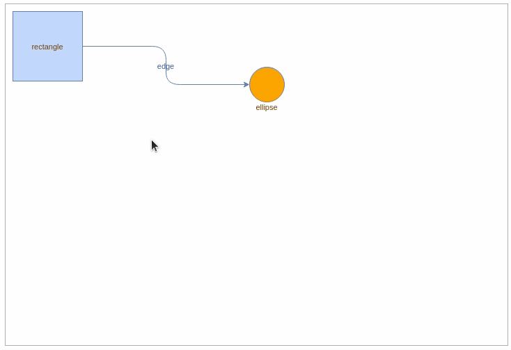

# maxGraph

[](https://www.npmjs.com/package/@maxgraph/core)
[](https://github.com/maxGraph/maxGraph/actions/workflows/build.yml)

<!-- copied into packages/core/README.md and packages/website/docs/intro.md -->
`maxGraph` is a TypeScript library which can display and allow interaction with vector diagrams. At a high level, it provides: 
- **Nodes**, also known as **vertices** which are typically represented by shapes like rectangles.
- **Edges** which can be lines and arrows which normally point between one node and another.

It provides many of the diagramming features which would be expected by a piece of presentation software like Microsoft® PowerPoint™
or LibreOffice® Impress such as being able to resize, move or rotate nodes, but has a stronger focus on automatic layout
algorithms and applications of [Graph Theory](https://en.wikipedia.org/wiki/Graph_theory). It is suited towards software
which requires finer-grained customization of functionality than off-the-shelf packages.
<!-- END OF 'copied into packages/core/README.md and packages/website/docs/intro.md' -->


The `maxGraph` library uses no third-party software, it requires no plugins and can be integrated in virtually any framework (it's vanilla JS).

`maxGraph` is the successor of [mxGraph](https://github.com/jgraph/mxgraph) which is now end of life.
At first, it provides the same features as `mxGraph` and adds
- TypeScript support
- maintained npm package
- modern modular, tree shakable, version of `mxGraph` to reduce the whole package size

New features will follow.


## Browser support

Chrome, Edge, Firefox, Safari, Chromium based browsers (Brave, Opera, ....) for mobile and desktop.

## Project status

`maxGraph` is currently under active development, with a few adjustments still required to match the behavior of `mxGraph`.
In the meantime, new features are also being added to enrich the library.

Please try it in your application and [submit an issue](https://github.com/maxGraph/maxGraph/issues) if you think that something is not working.

You can also test `maxGraph` by running the [Storybook examples](#development) or [build the npm package locally](#build-local-npm-package) to get the latest changes.

## Install

Install the latest version of `maxGraph` from the [npm registry](https://www.npmjs.com/package/@maxgraph/core).

npm
```
npm install @maxgraph/core
```

yarn
```
yarn add @maxgraph/core
```

pnpm
```
pnpm add @maxgraph/core
```

## Getting Started

Here is an example that shows how to display a rectangle connected to an orange circle.

This example assumes that
- you are building an application that includes the maxGraph dependency, and it has been installed as explained above.
- your application uses a build tool or a bundler for its packaging. Direct usage of `maxGraph` in a web page is not supported (for more details, see [#462](https://github.com/maxGraph/maxGraph/discussions/462)).
- your application includes a page that defines an element with the id `graph-container`.
- you want to use `TypeScript`, adapt it if you want to use `JavaScript` (mainly, remove references to the 'type' syntax).

```typescript
import {type CellStyle, Graph, InternalEvent} from '@maxgraph/core';

const container = <HTMLElement>document.getElementById('graph-container');
// Disables the built-in context menu
InternalEvent.disableContextMenu(container);

const graph = new Graph(container);
graph.setPanning(true); // Use mouse right button for panning
// Gets the default parent for inserting new cells. This
// is normally the first child of the root (ie. layer 0).
const parent = graph.getDefaultParent();

// Adds cells to the model in a single step
graph.batchUpdate(() => {
  const vertex01 = graph.insertVertex({
    parent,
    position: [10, 10],
    size: [100, 100],
    value: 'rectangle',
  });
  const vertex02 = graph.insertVertex({
    parent,
    position: [350, 90],
    size: [50, 50],
    style: {
      fillColor: 'orange',
      shape: 'ellipse',
      verticalAlign: 'top',
      verticalLabelPosition: 'bottom',
    },
    value: 'ellipse',
  });
  graph.insertEdge({
    parent,
    source: vertex01,
    target: vertex02,
    value: 'edge',
    style: {
      edgeStyle: 'orthogonalEdgeStyle',
      rounded: true,
    },
  });
});
```

You will see something like in the following _maxGraph panning_ demo:




## Documentation

The maxGraph documentation is available on the [maxGraph website](https://maxgraph.github.io/maxGraph). ⚠️ This is a **work in progress**, the content of the original _mxGraph_ documentation will be progressively migrated there ⚠️.

Until we provide a complete documentation, you can check the [mxGraph documentation](https://jgraph.github.io/mxgraph/).
The key resources are the JavaScript user manual which explain the concepts and how to start using the API, the JavaScript examples and the JavaScript API specification.
- https://jgraph.github.io/mxgraph/docs/tutorial.html
- https://jgraph.github.io/mxgraph/docs/manual.html
 
> Be aware that the maxGraph API doesn't fully match the mxGraph API (see the paragraph below about "[Migrating from mxGraph](#migrate-from-mxgraph)").


## Examples

For more complete examples than getting started,, please have a look at:

- the [storybook stories](packages/html/stories) which demonstrates various features of maxGraph.
  - The stories are currently written in `JavaScript` and will be progressively migrated to `TypeScript`.
  - A live instance is available on the [maxGraph webiste](https://maxgraph.github.io/maxGraph/demo).
- the [ts-example](packages/ts-example) project/application that demonstrates how to use `maxGraph` in a vanilla TypeScript application powered by [Vite](https://vitejs.dev/).
- the [js-example](packages/js-example) project/application that demonstrates how import and export the `maxGraph` model with XML data. It is in a vanilla JavaScript application buit with [Webapck](https://webpack.js.org/).
- the https://github.com/maxGraph/maxgraph-integration-examples repository which shows how to integrate `maxGraph` with different frameworks and build tools.


Notice that some elements produced by `maxGraph` require to use [CSS and images](packages/website/docs/usage/css-and-images.md) provided in the npm package.


## <a id="migrate-from-mxgraph"></a> Migrating from mxGraph

`maxGraph` APIs are not fully compatible with `mxGraph` APIs. The concepts are the same, so experienced `mxGraph` users should be able to switch from `mxGraph` to `maxGraph` without issues.

For a complete guide, see the [dedicated migration page](packages/website/docs/usage/migrate-from-mxgraph.md).


## TypeScript support

`maxGraph` is written in TypeScript and provides type definitions so `maxGraph` can be easily integrated into TypeScript applications.

`maxGraph` requires **TypeScript 3.8** or greater.


## Support

For usage question, please open a new [discussion](https://github.com/maxGraph/maxGraph/discussions/categories/q-a) on GitHub. You can also use
[GitHub discussions](https://github.com/maxGraph/maxGraph/discussions) for other topics like `maxGraph` development or to get the latest news.


## History

On 2020-11-09, the development on `mxGraph` stopped and `mxGraph` became effectively end of life.

On 2020-11-12, a fork of the `mxGraph` was created with a call to Contributors.

> 12 Nov 2020.
> 
> If you are interested in becoming a maintainer of mxGraph please comment on issue [#1](https://github.com/maxGraph/maxGraph/issues/1)
> 
> Initial objectives:
> 
> - The first priority is to maintain a working version of mxGraph and its **npm package**
> - The ambitious stretch goal is to refactor the codebase to create a modern modular, tree shakable, version of mxGraph to reduce the whole package size.
> 
> -- Colin Claverie

The project was then [renamed on 2021-06-02](https://github.com/maxGraph/maxGraph/discussions/47) into `maxGraph` due to [licensing issue](https://github.com/maxGraph/maxGraph/discussions/23).

Starting from the `mxGraph` 4.2.2 release, we
- moved code to ES9
- removed Internet Explorer specific code
- migrated to TypeScript, based on the work initiated in [typed-mxgraph](https://github.com/typed-mxgraph/typed-mxgraph)
- migrated the examples to [Storybook](https://storybook.js.org/)


## Development

### Clean former mxGraph tags

Ensure you don't have the former `mxGraph` tags locally (see [#92](https://github.com/maxGraph/maxGraph/issues/92) fore more details):
```
git fetch --all --tags --prune
```

### Setting up local development environment

NodeJS requirements:
- use the version declared in [.nvmrc](./.nvmrc). Other versions may work but are not supported.
- this is the version used by GitHub Actions
- nvm users can run `nvm use`. If the Node version is not installed, nvm will state how to install the required version.

Note: maxGraph relies on npm workspaces to build.

In the project root directory, execute

```sh
$ npm install
```

To watch the core package, execute:

```sh
$ npm run dev -w packages/core
```

To watch the examples provided as [Storybook](https://storybook.js.org/) stories, execute:

```sh
$ npm run dev -w packages/html
```

Since both commands are in watch mode, so it's recommended to open two terminals and run them separately. When a file is saved from the core package, the html storybook will be automatically updated.

For more details about `@maxgraph/html`, see the README that explains the [maxGraph examples](./packages/html/README.md).

### <a id="build-local-npm-package"></a> Building the npm package locally

**Reminder**: the released version are available at [npmjs](https://www.npmjs.com/package/@maxgraph/core). 

Run
- from the project root: `npm install`
- then, from the `packages/core` folder: `npm pack`

The `packages/core` folder or the generated `packages/core/maxgraph-core-***.tgz` file are now ready for use in your application, using [npm link](https://docs.npmjs.com/cli/v8/commands/npm-link) or `npm install`.

Examples of use can be found in the [maxgraph-integration-examples](https://github.com/maxGraph/maxgraph-integration-examples) repository.

### Release

See the dedicated [release](packages/website/docs/development/release.md) page.
