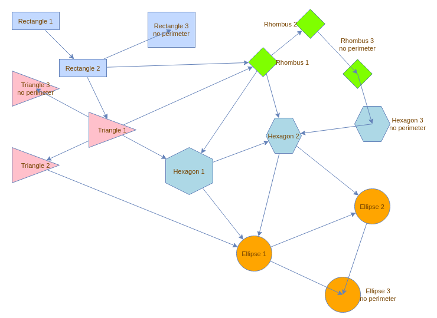

# Perimeters

:::info
The code examples provided on this page are written in `TypeScript`.
Don't forget to adapt them if you use `JavaScript`.
:::

## What is a Perimeter?

A `Perimeter` is a function that calculates the start or end point of the edge so that it is placed on the source or target shape.

A perimeter is then configured on the vertex. It must also match the shape of the vertex, otherwise the terminal point of the edge isn't placed on the visual perimeter of the vertex.

By default, the perimeter of a vertex is a _rectangle_.

It is possible to configure a vertex to not use a perimeter. In this case, the edge is connected to the center of the vertex. 
This center is calculated based on the bounds (i.e. the rectangle taken width and height of the shape) of the vertex.

The following image shows various perimeters in action and illustrates the difference between a vertex with a perimeter and a vertex without a perimeter.
It is taken from the Storybook demo.




## How to Use a Specific Perimeter

:::info
For more details about the usage of perimeters, see the documentation of `CellStateStyle.perimeter`
:::

`maxGraph` provides various perimeter functions under the `Perimeter` namespace to be used in the `style` property of a Vertex as the value of `CellStateStyle.perimeter`.

```javascript
style.perimeter = Perimeter.EllipsePerimeter;
```

It is also possible to set the perimeter using a string under which the perimeter has been registered in `StyleRegistry`.
By default, `maxGraph` registers all perimeters functions under the `Perimeter` namespace in the `StyleRegistry`:

```javascript
style.perimeter = 'rhombusPerimeter';
```

:::tip

The `CellStateStyle.perimeter` type guides you on how to set the perimeter value when configuring the value with a string.
It is also possible to use the `Constants.PERIMETER` enum to set the perimeter value with a perimeter provided by default.

:::

It is possible to configure the default perimeter for all vertices in the `Graph` as follows:

```javascript
const style = graph.getStylesheet().getDefaultVertexStyle();
style.perimeter = Perimeter.HexagonPerimeter;
```


### Creating a Custom Perimeter

A perimeter is a function matching the `PerimeterFunction` type:

```typescript
const CustomPerimeter: PerimeterFunction = (
    bounds: Rectangle,
    vertex: CellState,
    next: Point,
    orthogonal = false
    ): Point => {
  const x = 0; // Calculate x-coordinate
  const y = 0; // Calculate y-coordinate

  return new Point(x, y);
}
```

The new perimeter can then be registered in the `StyleRegistry` as follows if you are intended to use it as a string in `CellStateStyle.perimeter`:
```javascript
StyleRegistry.putValue('customPerimeter', CustomPerimeter);
```

### Using a Custom Perimeter

The custom perimeter above can now be used in a specific vertex as follows:

```javascript
model.setStyle(vertex, {...vertex.style, perimeter: 'customPerimeter'});
```

Or it can be used for all vertices in the `Graph` as follows:

```javascript
const style = graph.getStylesheet().getDefaultVertexStyle();
style.perimeter = CustomPerimeter;
```
